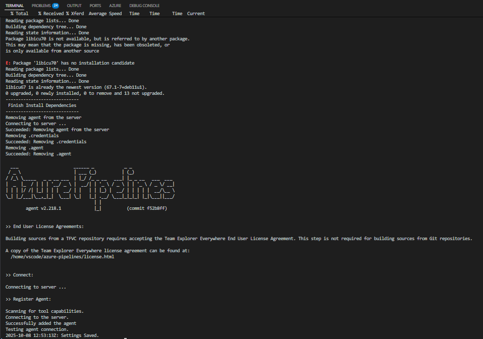
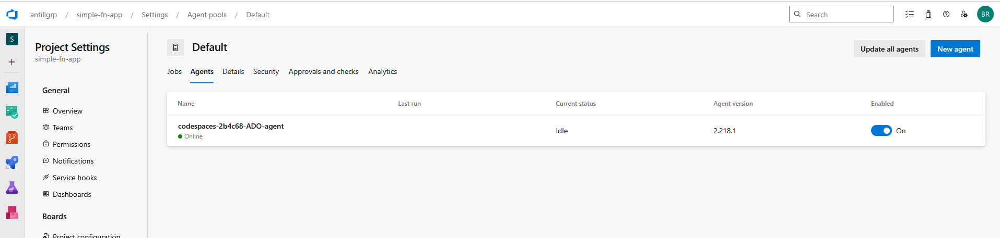
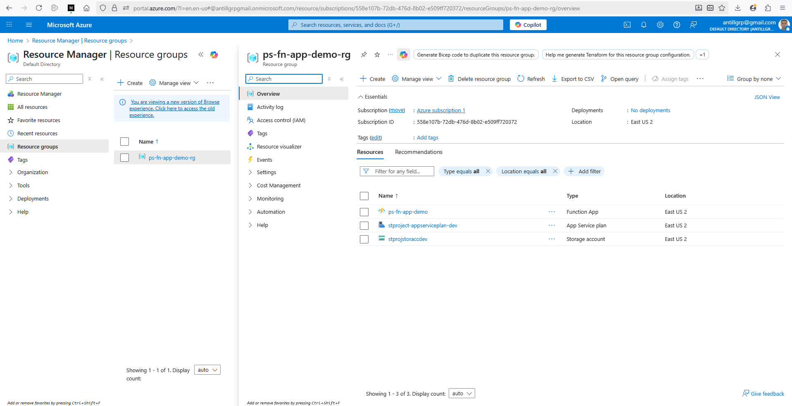
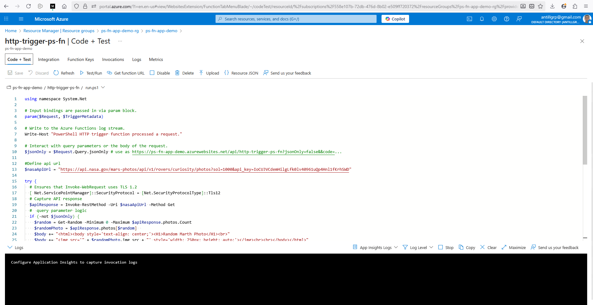
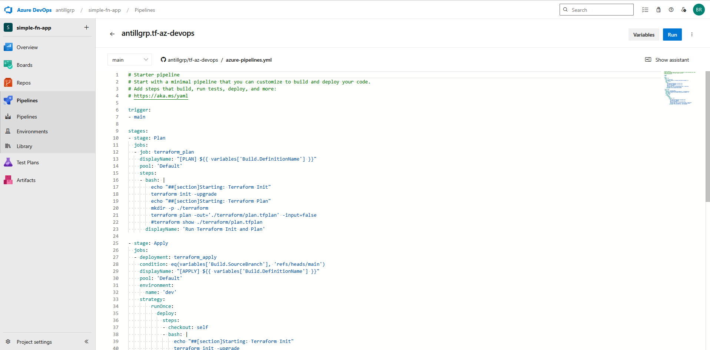
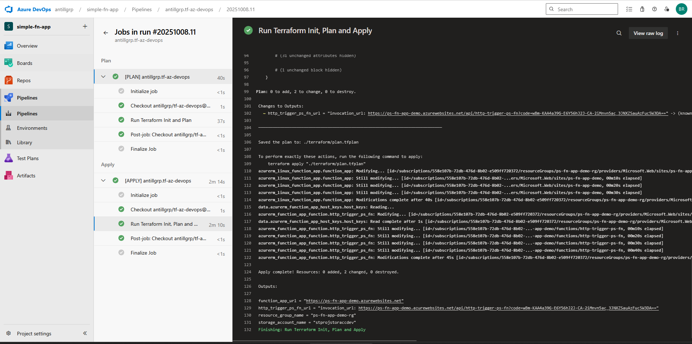
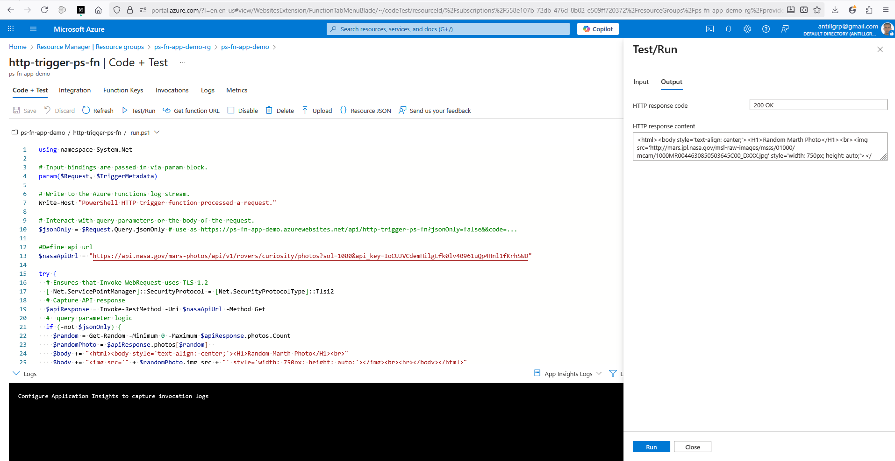
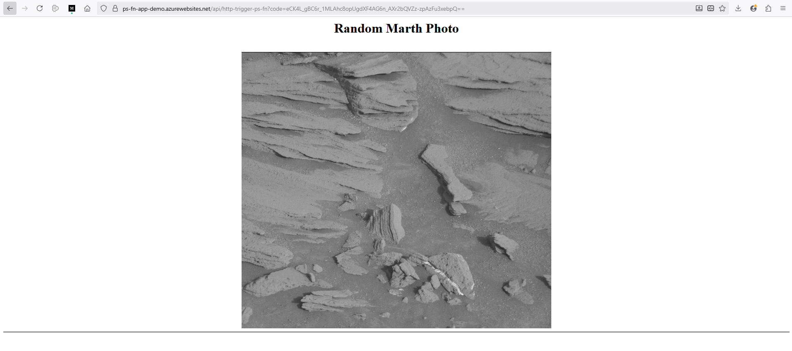
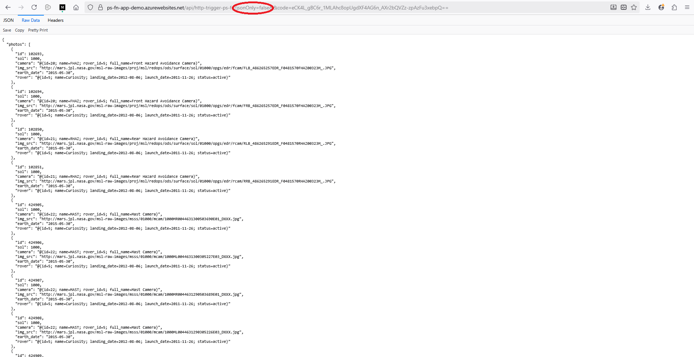

# tf-az-devops

> ### *Build a PowerShell function app (in azure or local dev tools is acceptable) that calls a public api to pull data (stock, weather, crypto coins) and returns that data to a client calling on the function app via a http trigger. Please provide documentation in code of how each step is functioning.*

# Features 
---
## 1. Implemented a github dev container that acts as azure devops agent 
#### 1.1 **./devcontainer/Dockerfile** --> build the docker image for the devcontainer
#### 1.2 **./devcontainer/docker-compose.yml** --> devcontainer docker stack ( core image, networking, etc.)
#### 1.3 **./devcontainer/devcontainer.json** --> devcontainer configuration
#### 1.3 **./devcontainer/scripts/start.sh** --> azdo agent service management
---


---



---
## 2. Implemented IAC with terraform to deploy all the required infrastructure
#### 2.1 **./main.tf** --> terraform infra solution

```
...
resource "azurerm_function_app_function" "http_trigger_ps_fn" {
  name            = "http-trigger-ps-fn"
  function_app_id = azurerm_linux_function_app.function_app.id
  language        = "PowerShell"
  
  file {
    name    = "run.ps1"
    content = file("${path.module}/run.ps1")
  }

  test_data = jsonencode({
    "name" = "Azure"
  })
  
  config_json = jsonencode({
    "bindings" = [
      {
        "scriptFile" : "run.ps1",
        "authLevel" = "function",
        "type" = "httpTrigger",
        "direction" = "in",
        "name" = "Request",
        "methods" = [ "get", "post" ]
      },
      {
        "type"      = "http",
        "direction" = "out",
        "name"      = "Response"
      }
    ]
  })
}
...
```
---



---



---

## 3. Implemented azdo devops build definition (pipeline)
#### 3.1 **./azure-pipelines.yml** --> pipeline definition that triggers when merging with main branch
---



---



---

## 4. Implemented the powershell azure function that connects to a public api to collect data
#### 4.1 **./run.ps1** --> function definition that is uploaded by IAC
---



---



---



---
### Thanks for your attention 
